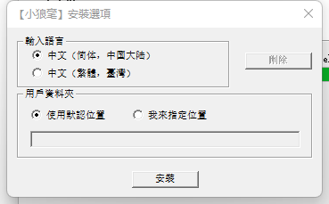
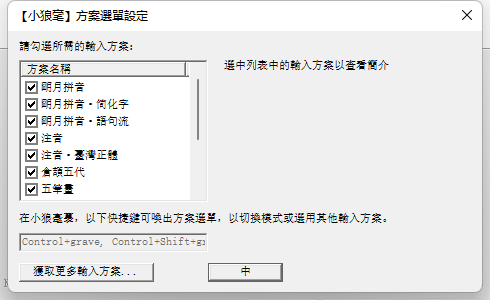
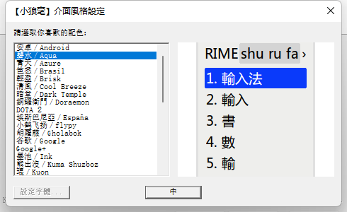
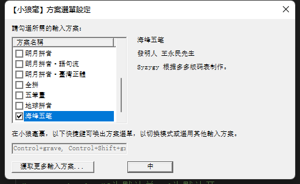

# 海峰五笔（HaiFengWuBi）
## 海峰五笔基于[rime](https://github.com/rime/weasel) 
* 原「海峰五笔」的Rime版码表，我模仿原作增加了若干符号的输入，并已经扩充到扩展G区汉字，零散加了一些H区的字，还在持续更新中。
* F区有很多编码错误，慎用之，有问题请随时反馈。
* 由于种种原因，现在的五笔编码和 Unicode 上的形不是很对得上。目前正在根据 Unicode 各源的 chart 字形修改、添加编码，随用随改，有这方面问题也请反馈。
* 还有一些是前人拟得不太合理的拆解，有些已经注释掉，有些直接删掉，更多情况下是增加了容错。有时会出于本人自己的喜好和理解增加一些不合规矩的编码，也是为了输入上的方便。
* 感谢“因Unicode改形及其他原因需要增改的五笔编码讨论群”群（862155643）群友的帮助。

## 依赖

* 依赖于[rime](https://github.com/rime/weasel)  > 0.15.0.0

## 使用方法
### 1.安装rime
如果使用海峰五笔必须要安装rime,因为HaiFengWuBi依懒于rime的功能配置文件。[https://rime.im/](https://rime.im/)

#### 安装过程中选择：中文 简体 中国大陆



#### 安装过程中rime会有多种输入法选择，你可以全选也可以选其中的一种如下图所示



#### 安装过程中会有多种的输入主题也就是输入法界面，你可以默认或使用一种你喜爱的一种。



### 2. 添加海峰五笔

### 当你完成rime的安装并重新起动计算机后在输入法中会增加一个rime输入法的图标。但这个时候你还不能使用海峰五笔需要进一步的设置才能使用


* rime在安装时会把安装文件与配置文件放在不同的地方现在我们需要的是对配置文件进行修改才能使用海峰五笔
* Rime 在加载输入法方案时是根据配置文件中的规则来查找和加载的。具体来说，Rime 会根据配置文件中的路径和名称规则来寻找输入法方案文件。
* 在 Windows 系统中，Rime 输入法会默认在以下位置寻找输入法方案文件：

* 1. 用户配置文件夹：`C:\Users\<用户名>\AppData\Roaming\Rime`
* 2. 系统配置文件夹：`C:\Program Files (x86)\Rime\data`

### 复制文件到指定目录
* haifengwubi.dict.yaml
* haifengwubi.schema.yaml
* 以上两文件复制到用户配置文件夹它应位于`C:\Users\<用户名>\AppData\Roaming\Rime`


在这两个位置，Rime 会查找以 `.schema.yaml` 结尾的文件作为输入法方案文件。因此，如果你的输入法方案文件名是 `haifengwubi.schema.yaml`，并且它位于用户配置文件夹或系统配置文件夹中的任意一个，Rime 就能找到这个输入法方案并加载它。

另外，Rime 在加载输入法方案时还会查找配置文件中 `schema_list` 下所列出的输入法方案，因此在 `default.custom.yaml` 文件中的 `schema_list` 部分，你需要添加一行 `- {schema: haifengwubi}`，以告诉 Rime 加载名为 `haifengwubi.schema.yaml` 的输入法方案。

需要注意的是，Rime 在加载输入法方案时会根据配置文件中的路径和名称规则进行查找，因此确保输入法方案文件放置在正确的位置，并在 `default.custom.yaml` 中正确地引用它，这样 Rime 才能正确地找到并加载你的五笔输入法方案。如果路径或文件名不正确，Rime 可能无法正确加载输入法方案。

## 文件配置
* 请将下列代码添加到你的`default.custom.yaml`文件中。这里需要注意的是我使用的是0.15.0.0版本因为你的安装版本的不同可能会有所不同

```
customization:
  distribution_code_name: Weasel
  distribution_version: 0.15.0.0
  generator: "Rime::SwitcherSettings"
  modified_time: "Sun Jul  2 13:27:23 2023"
  rime_version: 1.8.5
patch:
  schema_list:
    - {schema: luna_pinyin}
    - {schema: haifengwubi}
```

## 更改配置
* 当你配置完成后,需要重新配置以始你的海峰五笔生效。打开安装目录中的Rime文件在其中会有一个`WeaselDeployer.exe`文件双击它。
* 这个文件应位于系统配置文件夹：`C:\Program Files (x86)\Rime\data`我的安装目录在`c盘`对于`WeaselDeployer.exe`取决于你安装到那个盘符下。
* 如下图勾选海峰五笔



## 完成安装
* 现在你应可以使用海峰五笔了，在切换到rime输入法后你可以使用快捷键 <code>Ctrl+`</code> 或 <code>F4</code> 呼出方案選單、切換輸入方式。

## 一点使用札记
- 王码官网上有的编码则以之为准。
- 框形部件，一般不包东西的是K，包东西的是L。㔔下面视作K，末笔视作横；㐃则CHK，LHK均可。
